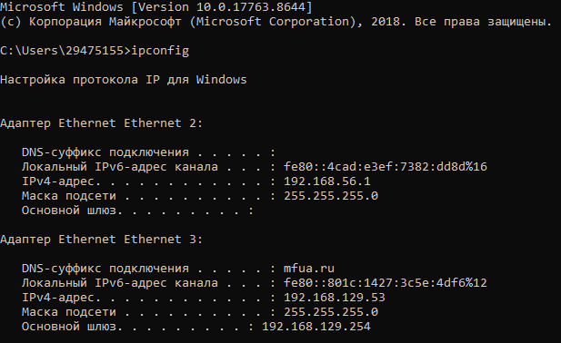
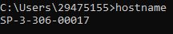
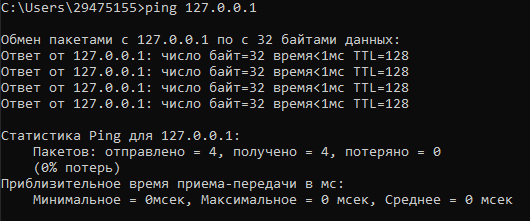
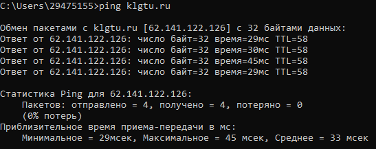
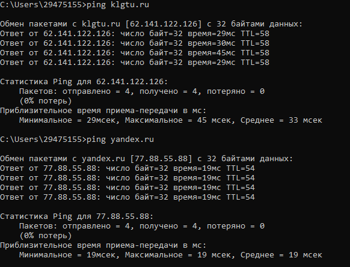
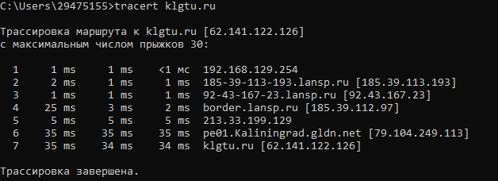
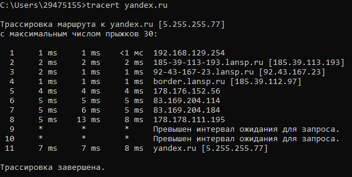
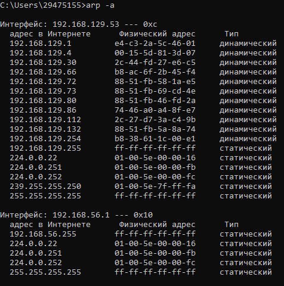
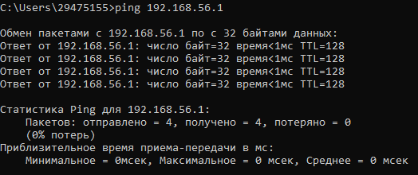
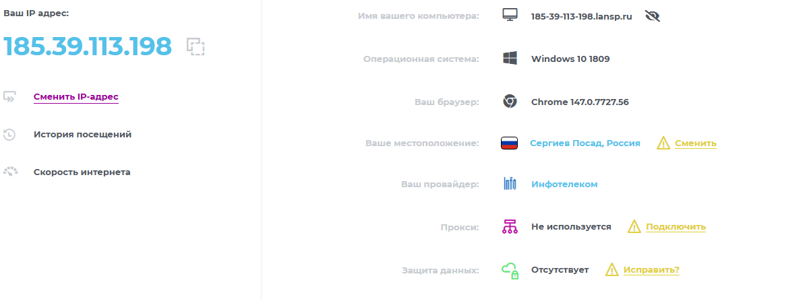

## Лабораторная работа №2
# "Изучение программных средств тестирования и определения параметров настройки в компьютерных сетях"
Цель работы: приобретение знаний и практических навыков в использовании программного обеспечения для настройки и тестирования компьютерной сети.

Материалы, оборудование, программное обеспечение: лаборатория, оснащенная персональными компьютерами, объединенными в локальную сеть с доступом в Интернет, утилиты сканирования беспроводных сетей.

Критерии положительной оценки: выполнение типовых заданий, оформление отчета по работе, ответы на вопросы для самопроверки.

# Теоретическое введение

Для тестирования параметров (маршрут и скорость передачи данных) соединения с глобальной сетью Интернет, а также проверки правильности сетевых настроек имеется большое количество программных средств. Например, в операционной системе MS Windows – это встроенные компьютерные программы – утилиты, которые позволяют оценить надежность соединения и ряд других важных параметров.

# Контрольные вопросы для самопроверки

# 1. Какой формат имени сетевого ресурса может использоваться при обращении к нему?

При обращении к сетевым ресурсам используются различные форматы имён, в зависимости от системы разрешения имён и протокола, который используется в сети. Основные форматы включают:
1. Имя компьютера (NetBIOS имя):
- Это плоское имя, которое однозначно идентифицирует компьютер в локальной сети.
- Используется в небольших одноранговых сетях и системах без централизованного управления.
2. Имя узла:
- Термин, который появился с введением службы WINS (Windows Internet Name Service).
- Это динамическое и централизованное хранилище имён компьютеров на основе NetBIOS.
- Используется для разрешения имён в больших сетях.
3. Полное доменное имя (FQDN — Fully Qualified Domain Name) Пример:``` server1.widgets.microsoft.com ```:
- Включает имя компьютера и иерархическую структуру доменов DNS.
- Применяется в крупных сетях с использованием DNS для разрешения имён.
4. Относительное уникальное имя:
- Это имя, которое является частью полного доменного имени до крайней левой точки.
- Пример: в FQDN ``` server1.widgets.microsoft.com ``` , server1 — это относительное уникальное имя.
- Используется для упрощения идентификации узлов в рамках одного домена.

Примеры использования:
- Локальная сеть: использование имени компьютера (server1) для идентификации в небольших сетях.
- Средние и крупные сети: использование полного доменного имени для обеспечения уникальности и централизованного управления.
- Централизованные серверы имён: использование WINS для разрешения имён в сетях, где DNS не применяется или используется совместно с ним.

Соглашения об именовании:

- Уникальность: имена должны быть уникальными в пределах домена или сети.
- Регистрация: имена могут регистрироваться через широковещательные запросы или централизованные серверы (WINS, DNS).
- Совместимость: поддержка различных форматов имён для обеспечения совместимости с разными системами разрешения имён.

# 2. Какой протокол необходим для работы с утилитой ping? Найти описание и характеристики протокола.

Для работы с утилитой ping необходим протокол ICMP (Internet Control Message Protocol). Этот протокол играет ключевую роль в диагностике и управлении сетевыми соединениями.

Описание ICMP
ICMP (Internet Control Message Protocol) — это сетевой протокол, определённый в стандарте RFC 792. Он является частью семейства протоколов TCP/IP и работает поверх IP-протокола (Internet Protocol), но сам не обеспечивает передачу пользовательских данных. Основная задача ICMP — помогать устройствам в сети сигнализировать о проблемах и передавать информацию, связанную с маршрутизацией.

Характеристики ICMP
1. Назначение:
- ICMP используется для диагностики сетевых проблем.
- Сигнализация об ошибках (например, сообщение о недоступности пункта назначения).
- Контроль и управление сетевым потоком.
2. Функции ICMP:
- Сообщения об ошибках: уведомление отправителя о возникших проблемах (например, Destination Unreachable, Time Exceeded).
- Диагностика: использование утилитами, такими как ping и traceroute, для проверки доступности узлов и маршрутов.
- Контроль потока: управление нагрузкой через сообщения (сейчас редко используются).
3. Типы ICMP-сообщений:
- Echo Request (тип 8): запрос на проверку доступности узла (используется ping).
- Echo Reply (тип 0): ответ на запрос Echo Request.
- Destination Unreachable (тип 3): сообщение о том, что пункт назначения недоступен.
- Time Exceeded (тип 11): сообщение о превышении времени жизни (TTL) пакета.
- Redirect (тип 5): перенаправление маршрута.
4. Инкапсуляция:
- Сообщения ICMP инкапсулируются в IP-пакеты и маршрутизируются вместе с ними.
- ICMP-сообщения не гарантируют доставку, так как они подвержены потере, как и любой другой сетевой трафик.

Примеры использования ICMP
- Ping: утилита ping использует ICMP Echo Request (тип 8) и Echo Reply (тип 0) для проверки доступности узла в сети.
- Traceroute: использует ICMP Time Exceeded (тип 11) для определения маршрута пакетов к пункту назначения.

Безопасность
Хотя ICMP полезен для диагностики и управления, он также может быть использован злоумышленниками для проведения атак, таких как Ping Flood и Ping of Death.
Таким образом, ICMP — это фундаментальный протокол для сетевой диагностики и управления, который позволяет проверять доступность узлов и диагностировать сетевые проблемы.

# 3. Зачем используется параметр all в утилите ipconfig?

Зачем используется параметр ``` /all ``` в утилите ``` ipconfig ```
Параметр ``` /all ``` команды ``` ipconfig ``` в Windows выводит полную конфигурацию TCP/IP для всех сетевых адаптеров — как физических (Ethernet, Wi‑Fi), так и логических (VPN‑подключения, виртуальные адаптеры и т. д.).

Без этого параметра ``` ipconfig ``` показывает только базовую информацию: IP‑адрес, маску подсети и шлюз по умолчанию для активных подключений.

Что именно отображается с ``` /all ```
При выполнении команды ``` ipconfig ``` ``` /all ``` выводится подробная информация по каждому сетевому интерфейсу, включая:
- Имя адаптера и описание (модель сетевой карты или тип подключения).
- Физический (MAC)‑адрес адаптера — уникальный идентификатор оборудования.
- DNS‑суффикс подключения (домен, используемый для автоматического дополнения имён при DNS‑запросах).
- IPv4‑ и IPv6‑адреса (если настроены).
- Маска подсети и шлюз по умолчанию.
- Адреса DNS‑серверов (первичный и вторичный).
- Адреса WINS‑серверов (если используются).
- Информация о DHCP: включён ли DHCP; IP‑адрес DHCP‑сервера; дата и время получения IP‑адреса; срок аренды IP‑адреса (когда нужно обновить аренду).
- Состояние DHCP и автонастройки (например, используется ли APIPA — Automatic Private IP Addressing).
- Дополнительные параметры TCP/IP (если заданы вручную).

Как использовать
1. Откройте командную строку (нажмите ``` Win + R ```, введите ``` cmd ```, нажмите Enter).
2. Введите команду: ``` cmd ```, ``` ipconfig /all ```
3. Нажмите Enter — на экране появится развёрнутый отчёт по всем сетевым интерфейсам.

Краткий итог
``` ipconfig /all ```:
- показывает максимально подробную информацию о сетевых адаптерах и их настройках;
- полезен для диагностики сетевых проблем, аудита конфигурации и выявления ошибок в настройках;
- дополняет базовую команду ipconfig, раскрывая детали, которые могут быть критичны для решения сетевых задач.

# 4. Каким образом утилиты ping и tracert осуществляют прослеживание маршрутов пакетов к заданному узлу?

# Утилита ``` ping ```
``` ping ``` в первую очередь проверяет доступность узла и измеряет время отклика, но может частично показывать маршрут — через специальные опции.

Основной механизм:
- Использует протокол ICMP (Internet Control Message Protocol).
- Отправляет Echo Request (тип 8) на целевой узел.
- Ждёт ответ Echo Reply (тип 0) от узла.
- Измеряет время между отправкой и получением (RTT — Round‑Trip Time).

Прослеживание маршрута через ping
Для частичного отображения маршрута используется ключ ``` -r ``` (Windows):
- ``` -r x ```, где x — число прыжков (1–9).
- Записывает IP‑адреса маршрутизаторов, через которые прошёл пакет.
- Работает только для IPv4.
- Требует ответа от целевого узла: если ответа нет, маршрут не отобразится.

Как это работает:
1. В ICMP‑пакете активируется опция записи маршрута (Record Route).
2. Каждый маршрутизатор, обрабатывающий пакет, добавляет свой IP‑адрес в специальное поле заголовка IP.
3. Целевой узел возвращает пакет с заполненным списком IP‑адресов.
4. ``` ping ``` выводит этот список.

Ограничения:
- Максимум 9 прыжков.
- Не показывает время на каждом участке.
- Зависит от поддержки опции маршрутизаторами и целевым узлом.

# Утилита tracert (Windows) / traceroute (Linux/macOS)
``` tracert ``` предназначена именно для полного прослеживания маршрута до узла.
Основной механизм:
- Также использует ICMP (в Windows) или UDP (в Linux/macOS).
- Последовательно отправляет пакеты с нарастающим значением TTL (Time To Live).
 
Пошаговый процесс:
1. Отправляется первый пакет с TTL = 1.
- Первый маршрутизатор уменьшает TTL до 0 и отбрасывает пакет.
- Маршрутизатор отправляет обратно сообщение ICMP Time Exceeded (тип 11, код 0).
- ``` tracert ``` фиксирует IP‑адрес первого маршрутизатора и время до него.
2. Отправляется второй пакет с TTL = 2.
- Пакет проходит через первый маршрутизатор (TTL становится 1), затем через второй.
- Второй маршрутизатор отбрасывает пакет (TTL = 0) и отправляет ICMP Time Exceeded.
- Фиксируется IP‑адрес второго маршрутизатора и время.
3. Процесс повторяется с увеличением TTL (3, 4, 5 и т. д.) до достижения целевого узла.
4. При достижении цели узел отвечает:
- ICMP Echo Reply (если используется ICMP, как в Windows);
- или отправляет ICMP Port Unreachable (если используются UDP‑пакеты на закрытый порт, как в Linux).
5. ``` tracert ``` завершает трассировку и выводит полный маршрут.

Ключевые параметры вывода:
- Номер прыжка (hop).
- IP‑адрес или имя узла (если разрешено разрешение DNS).
- Время прохождения пакета (обычно три попытки для оценки стабильности).

Важные нюансы
- Блокировка ICMP. Многие сети и файрволы блокируют ICMP‑трафик (особенно Echo Request/Reply и Time Exceeded). Это может приводить к «звёздочкам» (``` * ```) в выводе ``` tracert ```.
- Разные протоколы. В Linux ``` traceroute ``` по умолчанию использует UDP‑пакеты, а не ICMP. Это позволяет обходить некоторые блокировки, но требует выбора порта, который, скорее всего, закрыт на целевом узле.
- Асимметричные маршруты. Путь «туда» и «обратно» могут отличаться. ``` tracert ``` показывает только путь «туда».
- Таймауты. Если маршрутизатор не отвечает на ICMP‑запрос, утилита покажет ``` * ``` или ``` Request timed out ``` для этого прыжка.

Краткий итог
``` ping ``` может показать частичный маршрут (до 9 прыжков) через опцию ``` -r ```, но требует ответа от цели и поддержки опции маршрутизаторами.
``` tracert ``` (или ``` traceroute ```) строит полный маршрут, отправляя последовательность пакетов с нарастающим TTL и фиксируя ответы от каждого маршрутизатора. Это основной инструмент для диагностики сетевых маршрутов.

# 5. Можно ли утилитой tracert задать максимальное число ретрансляций?

Да, утилитой ``` tracert ``` можно задать максимальное число ретрансляций (прыжков/хопов) — для этого используется параметр ``` -h ```.

Как задать максимальное число ретрансляций
Синтаксис команды:
```cmd ```, ``` tracert -h <максЧисло> <целевой_узел> ```
Где:
``` -h <максЧисло> ``` — параметр, задающий максимальное количество прыжков (хопов), которые утилита будет проверять;
``` <целевой_узел> ``` — имя или IP‑адрес узла, к которому выполняется трассировка (например, ``` google.com ``` или ``` 8.8.8.8 ```).

Основные параметры команды tracert
Ключевые опции:
- ``` -d ``` — не выполнять разрешение IP‑адресов в имена узлов (ускоряет трассировку);
- ``` -h ``` максЧисло — максимальное число прыжков (по умолчанию — 30);
- ``` -j ``` списокУзлов — свободная маршрутизация по указанному списку узлов (только IPv4);
- ``` -w ``` таймаут — таймаут ответа в миллисекундах (по умолчанию — 4 000 мс);
- ``` -4 ``` — принудительное использование IPv4;
- ``` -6 ``` — принудительное использование IPv6.

# 6. Что такое localhost?

localhost — это зарезервированное имя хоста, которое указывает на текущий компьютер (то есть на тот же самый компьютер, который вы используете). По сути, это способ для устройства «обратиться к самому себе» через сетевые протоколы.

Технически localhost связан с петлевым (loopback) сетевым интерфейсом — виртуальным сетевым адаптером, который не требует физического подключения к сети. Весь трафик, отправленный на localhost, остаётся внутри устройства.

Основные IP‑адреса localhost
localhost обычно разрешается в следующие IP‑адреса:
- 127.0.0.1 — IPv4‑адрес петлевого интерфейса (самый распространённый);
- ::1 — IPv6‑адрес петлевого интерфейса.

Диапазон адресов ``` 127.0.0.0/8 ``` (от ``` 127.0.0.1 ``` до ``` 127.255.255.254 ```) зарезервирован для петлевых целей, но ``` 127.0.0.1 ``` используется чаще всего.

# Задание №1

Определить IP-адрес локального (своего) компьютера, подключенного к сети
Для определения IP-адреса своего компьютера в операционной
системе MS Windows необходимо воспользоваться утилитой IPCONFIG.

Для запуска данной программы необходимо выполнить команду ipconfig в режиме командной строки. При выполнении данной команды на экране монитора компьютера будет выведена основная конфигурация TCP/IP для всех сетевых адаптеров (см. рисунок 1).



Рисунок 1.

# Задание №2

Определить имя узла компьютера в локальной сети.

Для определения имени узла компьютера в локальной сети необходимо использовать утилиту HOSTNAME. После выполнения команды hostname в режиме командной строки на экран монитора выводится информация об имени узла компьютера в локальной сети (см. рисунок 2.).



Рисунок 2.

# Задание №3

Определить скорость передачи информации в компьютерной сети и наличие связи с узлом.

Проверить наличие пути до заданного узла и определить временные характеристики этого пути можно, используя утилиту PING, которая тестирует сетевое соединение путем посылки ICMP-пакетов типа «запрос эха», на которые получатель отвечает ICMP-пакетом типа «эхо-ответ». Утилите PING достаточно указать IP-адрес или DNS-имя, однако имеется ряд ключей, позволяющих более тонко управлять ее работой (перечень выводится на экран без указания в утилите IP-адреса или DNS-имени). Утилита PING выводит результат каждого запроса/ответа на отдельной строке, а перед завершением работы выдает статистику: минимальное, максимальное и среднее время передачи пакета, количество и долю потерянных пакетов. Фактически PING является основной утилитой при тестировании сетевых соединений.

При использовании утилиты PING совместно с ключом «-t» можно для тестирования скорости передачи информации отправлять в сеть неограниченное число пакетов. Например, при выполнении в командной строке команды ping –t ip_address (ключ –t отделяется пробелом от команды ping, ip_address – IP-адрес (или DNS-имя) компьютера, который используется для тестирования связи), будет происходить постоянная отправка пакетов и можно обнаружить ситуацию, при которой появляется или пропадает связь.

Если ответ не пришел в течение определенного времени, то считается, что между двумя устройствами отсутствует линия связи. Если в командной строке ввести команду ping 127.0.0.1 (127.0.0.1 — IP-адрес специального сетевого интерфейса в сетевом протоколе TCP/IP и обозначает, то же самое сетевое устройство (компьютер), с которого осуществляется отправка сетевого пакета или установление соединения). Использование адреса 127.0.0.1 позволяет устанавливать соединение и передавать информацию для программ-серверов, работающим на том же компьютере, что и программа-клиент, независимо отконфигурации аппаратных сетевых средств компьютера.

Это дает возможность протестировать корректность работы самой
утилиты (см. рисунок 3).



Рисунок 3. Тест на корректность работы утилиты

Обычно для тестирования скорости передачи информации отправляется четыре цифровых пакета по 32 байта каждый и определяется приблизительное время приема–передачи в миллисекундах (мс). Особенно важен параметр (время приема–передачи) для мультимедийных приложений, сетевых (on-line) игр и т.д. Для этих приложений этот параметр должен быть не более 500 мс. Если этот параметр менее 200 мс, то связь с сервером считается очень хорошей, если параметр больше 200 мс, то связь будет удовлетворительной или неудовлетворительной.

Для проверки наличия связи с узлом KLGTU.RU введем команду ping klgtu.ru (см. рисунок 4).



Рисунок 4. Тест проверки связи с узлом KLGTU.RU



Рисунок 5. Тест проверки связи с узлом YANDEX.RU

# Задание №4

Определить маршрут пакетов до заданного узла и получить временные характеристики для каждого промежуточного маршрутизатора на этом пути.

Выявлять последовательность маршрутизаторов, через которые проходит IP-пакет на пути к пункту своего назначения и время задержки на каждом из 27 них позволяет утилита TRACERT. Для выполнения утилиты необходимо указать IP-адрес или DNS-имя конечного узла. Более тонко управлять ее работой позволяют ключи (перечень выводится на экран без указания в утилите IP-адреса или DNS-имени). Утилита, как и ранее описанная PING, отправляет серию пакетов ICMP с разными значениями TTL (Time to live). В вычислительной технике и компьютерных сетях — предельный период времени или число итераций, или переходов, за который набор данных (пакет) может существовать до своего исчезновения.

Для каждого пакета на экране отображается величина интервала времени между отправкой пакета и получением ответа. Символ «*» означает, что ответ на данный пакет не был получен. Если узел не отвечает, то при превышении интервала ожидания ответа выдается сообщение «Превышен интервал ожидания для запроса». Интервал ожидания ответа может быть изменен с помощью ключа «–w» команды TRACERT. Для трассировки маршрута до узла KLGTU.RU выполним команду tracert klgtu.ru (см. рисунок 7).



Рисунок 6. Трассировка маршрута до узла KLGTU.RU



Рисунок 7. Трассировка маршрута до узла YANDEX.RU

# Задание №5

Определить соответствие локального IP-адреса, физическому (аппаратному) адресу в локальной сети. 

Возможность просматривать и изменять ARP-таблицу, в которой хранятся пары «МАС-адрес - IP-адрес» для тех узлов, с которыми в недавнем происходил обмен данными, дает утилита ARP. Эта таблица формируется автоматически при работе сетевого узла, но администратор сети может вносить в нее записи вручную. 

Узел, собирающийся отправить сообщение другому узлу, должен предварительно узнать MAC адрес получателя сообщения. Для решения данной задачи узел применяет технологию ARP, отправляя запрос узлам своей локальной сети. Данный ARP запрос содержит IP адрес получателя. Из всех узлов, получивших данный запрос, отвечает лишь тот, у кого соответствующий IP адрес. В своем ответе (ARP отклике) этот узел сообщает свой MAC адрес. И лишь после этого первый узел сможет отправить ему свое сообщение. Компьютеры чаще всего отправляют свои сообщения маршрутизатору и, следовательно, в своих ARP запросах они указывают адрес основного шлюза. Для уменьшения ARP трафика компьютеры хранят в своей памяти таблицу с IP и MAC адресами тех устройств, с которыми они в последнее время обменивались сообщениями. Управление работой утилиты возможно с помощью ключей (перечень выводится на экран командой arp). Утилита ARP с ключом -a позволяет вывести на экран всю ARP-таблицу. Выполним команду arp -a (см. рисунок 9).



Рисунок 8. ARP-таблица соответствия адресов

# Задание №6

Wireless Network Watcher - бесплатная утилита, которая сканирует беспроводные сети и отображает список всех подключенных в данный момент компьютеров и устройств. Для каждого обнаруженного устройства отображается такая информация, как IP- и MAC-адрес, название компании производителя и имя компьютера или устройства. Скопируем утилиту на свой компьютер (прилагается к методическим указаниям) и выполним команду WNetWatcher.exe (См. рисунок 10). Дополнительная информация (в столбцах, которые не показаны на рисунке) содержит сведения о времени и числе обнаружений устройства в сети, его активности в настоящий момент времени. Используя ранее изученную сетевую утилиту PING определить скорость передачи информации в компьютерной сети и наличие связи с подключенными устройствами (узлами) беспроводной сети (См. рисунок 11).


Рисунок 9. Результат сканирования беспроводной сети.



Рисунок 10. Результат сканирования беспроводной сети.

# Задание №8

Интернет-сервисы тестирования и определения параметров компьютерной сети.

2IP Интернет-сайт — набор интернет-сервисов. 2ip.ru — сайт, предоставляет пользователю множество сервисов: возможность узнать IP-адрес компьютера, проверку скорости соединения, проверку открытия порта, получение информации об интернет-ресурсах (IP и т. д.) и др. Также на сайте присутствует рейтинг провайдеров. При заходе на 2ip.ru – бонусом к функции определения IP предоставляется обзор 31 дополнительных данных об ОС, браузере, месте расположения и интернетпровайдере (см. рисунок 13).



Рисунок 11. Информация с сайта 2ip.ru