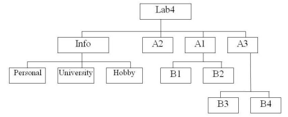
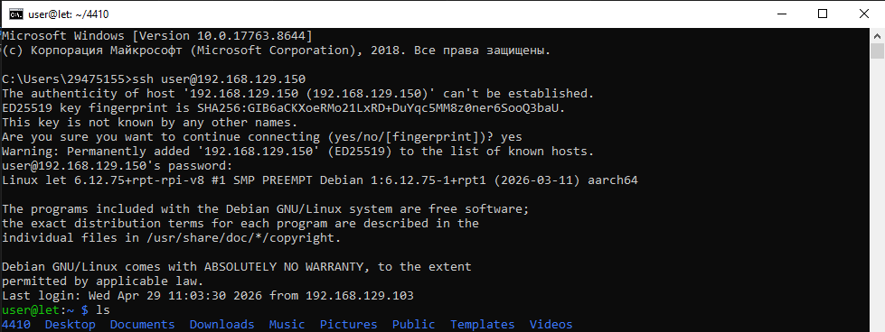
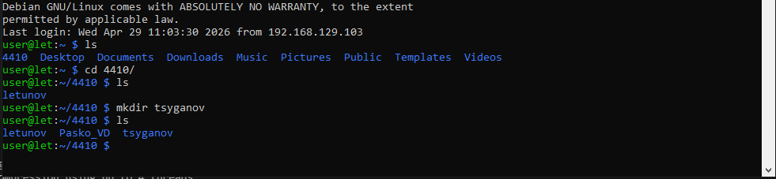
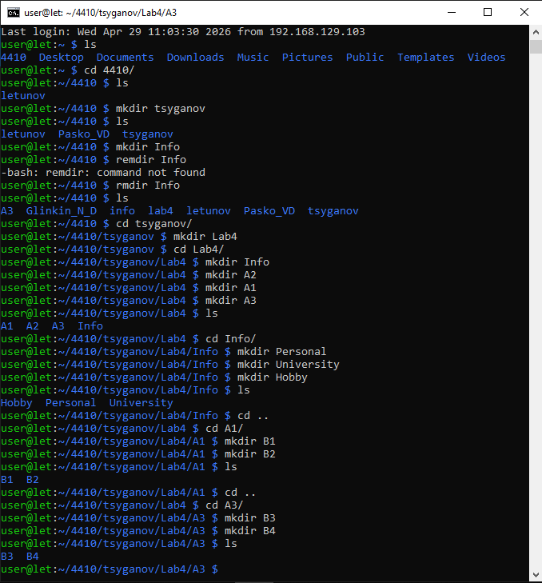
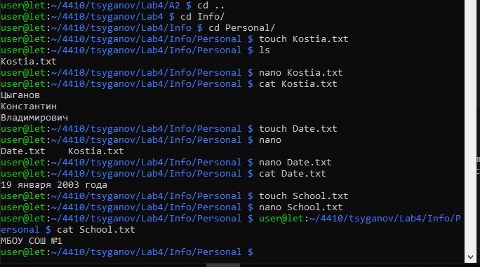
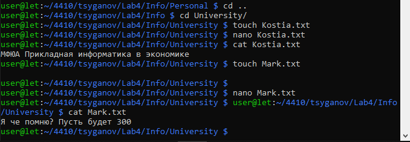
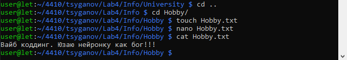

## Лабораторная работа № 4 Командная строка Windows

# Цель работы: Развитие профессиональных навыков работы в командной строке Windows.

Задачи работы:
- Создание структуры каталогов;
- Создание, просмотр, редактирование, удаление файлов;
- Удаление структуры каталогов;
- Манипулирование операционной системой Windows с помощью командной строки.

# Вариант №4



# Подключение по SSH



# Создание собственного каталога



# Создании директории файлов



# В каталоге Personal создать файл:
 Name.txt, содержащий информацию о фамилии, имени и отчестве студента. Здесь же создать файл Date.txt, содержащий информацию о дате рождения студента. В этом же каталоге создать файл School.txt, содержащий информацию о школе, которую закончил студент.



# В каталоге University создать файл:
Name.txt, содержащий информацию о названии вуза и специальность, на которой студент обучается. Здесь же создать файл Mark.txt с оценками на вступительных экзаменах и общей суммой баллов.



# В каталоге Hobby создать файл:
hobby.txt с информацией об увлечениях студента.



## Контрольные вопросы

# 1. Что такое командная строка?

Простыми словами, командная строка (или терминал) — это способ управления компьютером с помощью текстовых команд, а не кликов мышкой по картинкам.

Если графический интерфейс (рабочий стол с окнами и кнопками) — это "общение жестами", то командная строка — это разговор с компьютером на его командном языке. Вы пишете слово или фразу, нажимаете Enter, а компьютер выполняет действие и выводит ответ текстом.

# Как это выглядит?

Вы открываете специальную программу (например, ``` cmd ``` в Windows или ``` Терминал ``` в macOS/Linux) и видите черный (или белый) экран с текстом.

Обычно там написано что-то вроде:
``` C:\Users\Имя_Пользователя> ```

# Зачем она нужна, если есть удобная мышка?

Для обычного просмотра фильмов и игр она и не нужна. Но командная строка незаменима в трех случаях:

1. Для тонкой настройки и скрытых возможностей: Многие продвинутые настройки Windows или macOS вообще не отображаются в менюшках. Их можно изменить только введя точную текстовую команду (например, восстановить загрузчик Windows, изменить скрытые параметры сети или энергопотребления).

2. Для автоматизации рутины: Если вам нужно каждый день переименовывать 100 файлов, вручную кликать мышкой — час работы. А в командной строке можно написать одну строчку (например, ``` ren *.txt *.bak ```), которая сделает всё за секунду. Скрипты (пакетные файлы .bat) позволяют полностью автоматизировать действия.

3. Для администраторов и разработчиков: Сервера (на которых работают сайты и приложения) часто не имеют графического интерфейса. Чтобы управлять ими удаленно, нужно уметь пользоваться командами. Программисты тоже постоянно используют командную строку для компиляции кода, управления версиями (Git) или запуска серверов.

# 2. Перечислите основные команды управления файлами в командной строке.


# 3. Перечислите команды вывода основной информации системы.


# 4. Перечислите команды ввода/вывода файлов.


# 5. Возможно ли полноценное управление системой, пользуясь только командной строкой? Ответ обоснуйте.


# 6. Подумайте, чем отличается командная строка Windows от командной строки MS-DOS, несмотря на их схожесть в командах.


# 7. Приведите примеры интерпретаторов команд в других операционных системах.